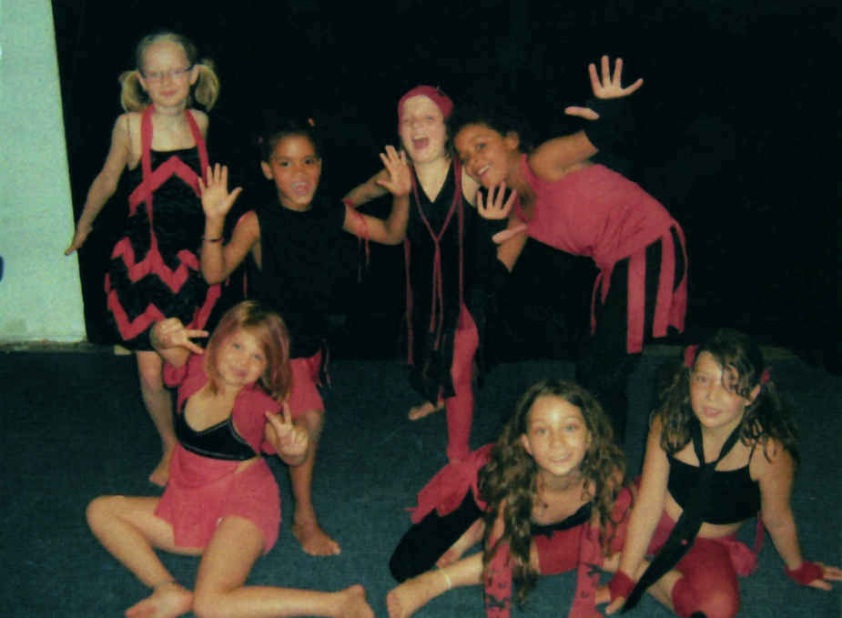

## Projekt: „Zusammen sind wir stark“ 2007

Auf der Freien Schule Kreuzberg gibt es von der 1. bis zur 6. Klasse 30 Kinder und es gab 2008 insgesamt nur 5 
Mädchen im ähnlichem Alter, die sich nicht als Gruppe wahrnahmen. Um ihr Gruppen- und Teamgefühl zu stärken, 
wurde nach gemeinsamen Interessen gesucht. Daraus entstand das Projekt:     „ Zusammen sind wir stark“.  
Die Mädchen gründeten eine Jazzdance Gruppe und wählten gemeinsam ein Lied aus. Jedes Mädchen hat sich 
zu einem Teilstück des Liedes eine Tanzbewegung überlegt. Daraus entstand eine gemeinsame Choreografie, 
die sie am Tag der offenen Tür aufführten. Unter Vorgaben zweier Farben und etwas Altem schneiderten sie sich 
ihre eigenen Kostüme für den Auftritt. 